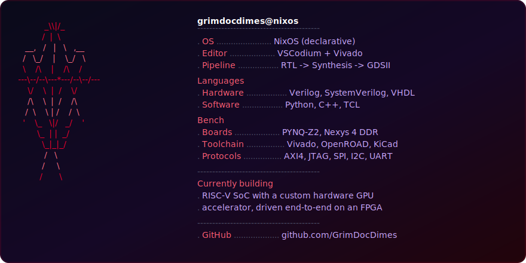

 

 

## What I'm building

<table>
<tr>
<td width="50%" valign="top">

**[zynq-cnn-fpga](https://github.com/GrimDocDimes/zynq-cnn-fpga)**
Real-time MobileNetV1 object detection, offloaded from the ARM PS core to custom Verilog IP on a Zynq FPGA.
`Verilog` `C++` `HLS` `PYNQ-Z2`

</td>
<td width="50%" valign="top">

**[riscv-gpu-soc](https://github.com/GrimDocDimes/riscv-gpu-soc)**
A complete SoC — PicoRV32 RISC-V core coupled over AXI4 to a custom 2D GPU accelerator.
`Verilog` `RISC-V` `AXI4` `PYNQ-Z2`

</td>
</tr>
<tr>
<td width="50%" valign="top">

**[2d-gpu-pynq](https://github.com/GrimDocDimes/2d-gpu-pynq)**
Pipelined Bresenham line engine in Verilog with AXI4 burst DMA — renders straight to display, zero software overhead.
`Verilog` `AXI4` `PYNQ-Z2`

</td>
<td width="50%" valign="top">

**[AES-128](https://github.com/GrimDocDimes/AES-128)**
Full RTL → GDSII physical design flow for an AES-128 core: synthesis, floorplanning, placement, CTS, routing.
`Verilog` `OpenROAD` `VLSI`

</td>
</tr>
</table>

Other repos

 

- **[FPGA-AES](https://github.com/GrimDocDimes/FPGA-AES)** — pipelined AES-128 engine on Nexys 4 DDR, deployed via JTAG-to-AXI
- **[Sobel-Operator-FPGA](https://github.com/GrimDocDimes/Sobel-Operator-FPGA)** — wire-speed pipelined Sobel edge detector
- **[Signal-Modulation-App](https://github.com/GrimDocDimes/Signal-Modulation-App)** — AM/FM/PM modulation visualizer
- **[Tamper-Detection](https://github.com/GrimDocDimes/Tamper-Detection)** — ESP32 anti-tamper weighing system
- **[NetSentry](https://github.com/GrimDocDimes/NetSentry)** — network traffic monitoring & intrusion detection
- **[Binary-Exploit](https://github.com/GrimDocDimes/Binary-Exploit)** — pwntools-based exploit dev assistant

 

 

 

